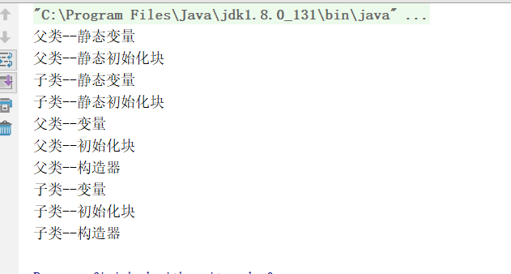

- parent -- static variables (first written first initialized)

- parent -- static initialization blocks

- child -- static variables

- child -- static initialization blocks

- parent -- instance variables

- parent -- instance initialization blocks

- parent -- constructor

- child -- instance variables

- child -- instance initialization blocks

- child -- constructor

