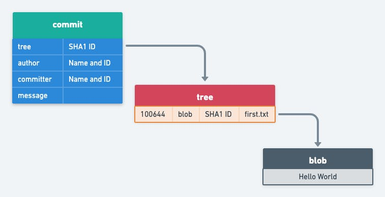

[TOC]


# Plumbing and Porcelain


## Porcelain

- ```bash
    git init [<folder name>]
    ```

- ```bash
    git add <file name>
    ```

- ```bash
    git commit -m <message>
    ```

    

## Plumbing

- create a blob object and add to git local repository as a loose object, but never create the file.

    ```bash
    git hash-object -w -t blob <file name>
    ```


- add the blob object into index file, AKA staging the blob

    ```bash
    git update-index --add --cacheinfo <mode> <sha1> <path>
    ```


- create a tree object and add to git local repository

    ```bash
    git write-tree
    ```


- create a commit object, or wrapping the tree object, and add it to git local repository

    ```bash
    git commit-tree [(-p <parent sha1>)...] <tree sha1>
    ```

 

- update the refs: <active branch> and HEAD, taking master as example

    ```bash
    git update-ref refs/heads/master <commit sha1>
    git symbolic-ref HEAD refs/heads/master
    ```


# Git Objects

- includes blob, tree, commit and tag
- kept at .git/object


## Blob

- create (also save in oject tree)

    ```bash
    git hash-object -w -t blob <file>
    ```

    

- stage

    ```bash
    git update-index --add --cacheinfo <mode> <>blob sha1> <file name>
    ```

    

## Tree

- create from index (also save in object tree)

    ```bash
    git write-tree
    ```


## Commit

tree wrapper: metadata + tree




- create from a tree

    ```bash
    git commit-tree <tree sha1> [(-p <parent sha1>)...]
    ```

    


## Tag

- light-weight tag
- annotation tag


# Git reference (branch and HEAD)

Basically, branch is just a reference, or a pointer to a specified commit. So, **.git/refs/heads** will not show a branch until you make a commit on that branch, otherwise <branch> has nothing to point to.


## Category

includes **common refs** and **symbolic refs**:

- common refs: kept in .git/refs/heads, such as master in **.git/refs/heads/master**
- symbolic refs: kept in .git/<symbolic>, such as HEAD in **.git/HEAD**


## Content

common refs point to commits, while symbolic refs to common ones

- ```bash
    $ cat .git/refs/heads/master
    475653c892605aa2604c61bc10011747728270b3
    ```

- ```bash
    $ cat .git/HEAD
    ref: refs/heads/master
    ```


## Mutate

- ```bash
    git update-ref refs/heads/<ref> <sha1>
    ```

- ```bash
    git symbolic-ref HEAD refs.heads/master
    ```


# Git reset


## Without filename

```bash
git reset [--soft | --mixed | --hard] <commit sha1>
```

### current status


### git reset --soft HEAD~


### git reset --mixed HEAD~


### git reset --hard HEAD~


## With filename

```bash
git reset [-q] [<tree-ish>] [--] <pathspec>...
```

- Reset the **index** file, for all paths match the <pathspec> to their state at <tree-ish>. 
- Does not affect the working tree or <current branch> reference.
- By default, <tree-ish> is **HEAD**.


### tree-ish (also treeish)

A [tree object](https://git-scm.com/docs/gitglossary#def_tree_object) or an [object](https://git-scm.com/docs/gitglossary#def_object) that can be recursively dereferenced to a tree object. Dereferencing a [commit object](https://git-scm.com/docs/gitglossary#def_commit_object) yields the tree object corresponding to the [revision](https://git-scm.com/docs/gitglossary#def_revision)'s top [directory](https://git-scm.com/docs/gitglossary#def_directory). The following are all tree-ishes: a [commit-ish](https://git-scm.com/docs/gitglossary#def_commit-ish), a tree object, a [tag object](https://git-scm.com/docs/gitglossary#def_tag_object) that points to a tree object, a tag object that points to a tag object that points to a tree object, etc.