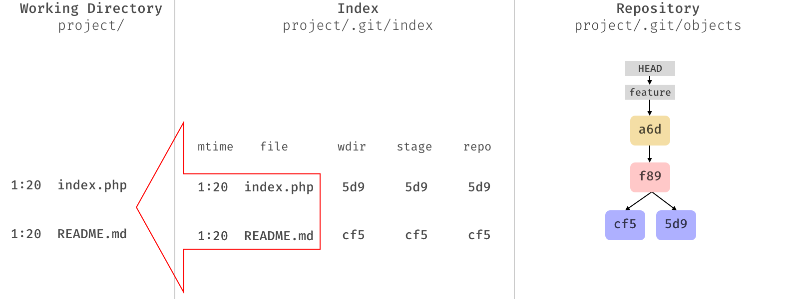
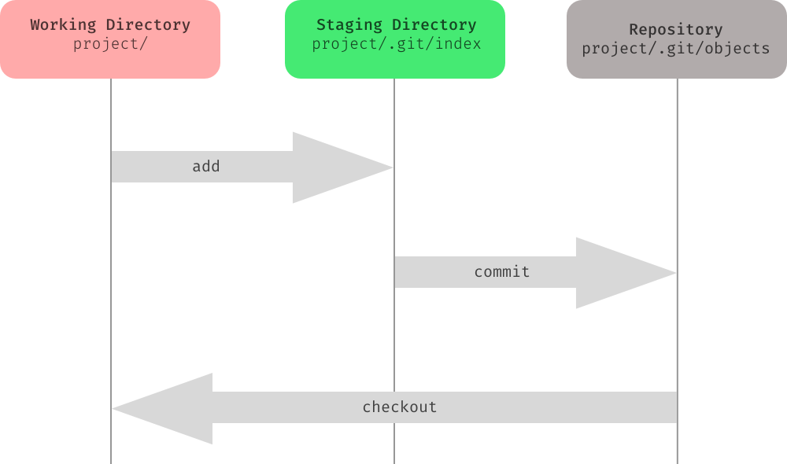

# Gitlet Design Document

**Name**: eYyoz


## Classes and Data Structures

### Blob

- A class represents a file, the minimal unit in gitlet persistence.
- It is immutable. By saying "immutable", it means when a file in the wokring tree changes, gitlet will create a new blob pointing to it.

The old blob will be token away by git gc, which is not suported in gitlet.

- A blob instance is serialized at 'gitlet/ojects' folder, while path is given by sha1 hash of the file content


#### Fields

1. ```java
    final String path;
    ```

    

2. ```java
    final String content;
    ```


 3. ```java
    final String sha1;
    ```


### Commit

- A wrapper class of a tree, including metadata, references to all blobs it contains, and references to parents(up to 2)
- It is immutable.
- Also serialized and stored at 'gitlet/objects' folder


#### Fields

1. ```java
    //key: relative path under CWD
    //value: sha1
    final HashMap<String, String> blobs;
    ```

2. ```java
    public final String sha1;
    ```

    

3. ```java
    //stores the sha1 hash of parents, rather than parents objects
    public final List<String> parents;
    ```

     

4. ```java
    //Constants
    static final ZoneId shanghai = ZoneId.of("Asia/Shanghai");
    static final DateTimeFormatter formatter = DateTimeFormatter.ofPattern("dd-MM-yyyy HH:mm:ss");
    ```

     

5. ```java
    //metadata
    final String message;
    final ZonedDateTime date;
    ```

    

### Repository

- Handles all the persistence, including storing objects
- Keeps a map which stores information like git index file, which act likes a virtual working tree
- The factory to generate commit objects



### GitletService

- Service class to response to gitlet commands
- Delegate tasks to Repository


## Algorithms

- content addressable: gitlet object sha1 -->  location
- three tree structure:
    - working tree: CWD
    - staging tree: .gitlet/index
    - git commit tree: git local repository




## Persistence

